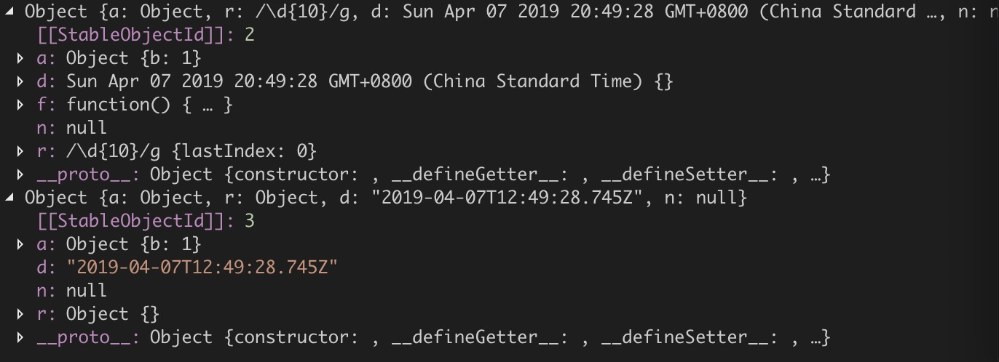

### JSON

使用JSON.stringify和JSON.parse来实现，RegExp对象，Date对象，函数拷贝有问题。

```js
const deepCopy = obj => JSON.parse(JSON.stringify(obj));
const obj = {
  a: { b: 1 },
  r: new RegExp(/\d{10}/g),
  d: new Date(),
  n: null,
  f: function() {
    console.log("aaaa");
  }
};
console.log(obj, deepCopy(obj));
```

截图



### 简单自己实现

```js
const deepCopy = obj => {
  if (obj === null) return null;
  if (typeof obj !== "object") return obj;
  if (obj instanceof RegExp) return new RegExp(obj);
  if (obj instanceof Date) return new Date(obj);
  let _obj = new obj.constructor();
  for (let key in obj) {
    _obj[key] = deepCopy(obj[key]);
  }
  return _obj;
};
```

